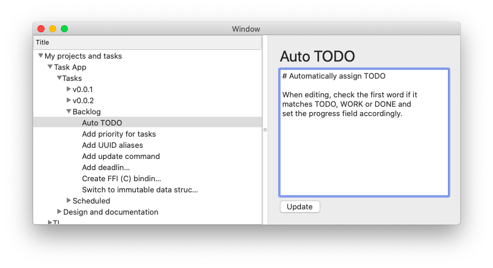

# Sors for macOS

This project is mostly just for me to learn how to write a macOS application
which uses a backend library which is written in a different language.  I
use the sors library I write in Rust, create C bindings and in this project,
I create a wrapper in Swift so it feels more naturally.

# Does it look awesome?

Not sure, I'm glad it's working.  Take a look:

# That's ugly!

Hey, I already told you, it's just a prototype and I'm just try to learn!
